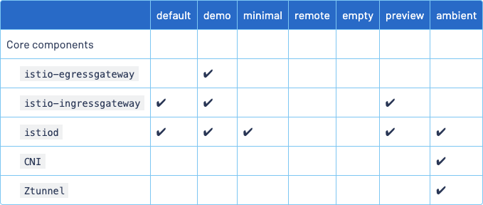

# Helm 기반 istio 설치 가이드 문서
# istio 
- https://istio.io/latest/docs/setup/install/helm/
  - Documentation / Sidecar Mode / Install / Install with Helm

<br/>

# helm repo 검색
```bash
helm search repo istio
NAME                               	CHART VERSION	APP VERSION	DESCRIPTION
bitnami/wavefront-adapter-for-istio	2.0.6        	0.1.5      	DEPRECATED Wavefront Adapter for Istio is an ad...
istio/istiod                       	1.27.1       	1.27.1     	Helm chart for istio control plane
istio/istiod-remote                	1.23.6       	1.23.6     	Helm chart for a remote cluster using an extern...
istio/ambient                      	1.27.1       	1.27.1     	Helm umbrella chart for ambient
istio/base                         	1.27.1       	1.27.1     	Helm chart for deploying Istio cluster resource...
istio/cni                          	1.27.1       	1.27.1     	Helm chart for istio-cni components
istio/gateway                      	1.27.1       	1.27.1     	Helm chart for deploying Istio gateways
istio/ztunnel                      	1.27.1       	1.27.1     	Helm chart for istio ztunnel components
```
<br/>


# helm repo 추가 & update
## helm repo 추가
- 위에서 찾은 것을 연결해주거나 또는 다음과 같이 추가 (공식문서 제공)
- 참고 : 
  - https://istio.io/latest/docs/setup/install/helm/

```bash
helm repo add istio https://istio-release.storage.googleapis.com/charts
"istio" has been added to your repositories

## 확인
helm repo list
istio       	https://istio-release.storage.googleapis.com/charts
```
<br/>

## helm update
```bash
helm repo update
```
<br/>

# 버전 선택
istio 버전 등을 잘 확인해보고 `APP VERSION` 에 맞도록 설치합니다. 특정 버전을 설치하려고 할 경우에 대해서는 글의 후반부에 따로 설명하겠습니다. 2025/10/09 현재 최신 버전은 1.27.1 버전이기에 1.27.1 버전을 선택해서 설치했습니다.
```bash
helm search repo istio
NAME                               	CHART VERSION	APP VERSION	DESCRIPTION
bitnami/wavefront-adapter-for-istio	2.0.6        	0.1.5      	DEPRECATED Wavefront Adapter for Istio is an ad...
istio/istiod                       	1.27.1       	1.27.1     	Helm chart for istio control plane
istio/istiod-remote                	1.23.6       	1.23.6     	Helm chart for a remote cluster using an extern...
istio/ambient                      	1.27.1       	1.27.1     	Helm umbrella chart for ambient
istio/base                         	1.27.1       	1.27.1     	Helm chart for deploying Istio cluster resource...
istio/cni                          	1.27.1       	1.27.1     	Helm chart for istio-cni components
istio/gateway                      	1.27.1       	1.27.1     	Helm chart for deploying Istio gateways
istio/ztunnel                      	1.27.1       	1.27.1     	Helm chart for istio ztunnel components
```
<br/>

제 경우에는 1.25.4 버전을 설치하려다가 해당 릴리즈 내에서 values 파일 등이 잘못되어 있어서 설치 에러가 발생했는데 이 과정에서 다음과 같이 values 파일을 다운로드 받아서 무슨 문제가 있었는지 확인했습니다.
```bash
helm show values istio/gateway --version 1.25.4 > gateway-values.yaml
```

결과적으로는 1.27.1 버전을 설치하기로 했습니다. 최신 버전이 항상 최신 버그를 찾아서 수정했다거나 상위 버전으로 옮길 때 하위 버전에서 해결되지 않은 호환성이 발생하는 것 같아서 였습니다.

이미 설치된 것을 upgrade 해서 install 하는 명령어의 예시는 다음과 같습니다.
```bash
## upgrade 설치
helm upgrade --install istio-base istio/base --namespace istio-system --create-namespace --version 1.27.1 --set profile=demo
```
<br/>

istio 버전들을 확인할 수 있는 링크들은 다음과 같습니다.
Documentation / Sidecar Mode / More Guides / Download the Istio release
- https://istio.io/latest/docs/setup/additional-setup/download-istio-release/
- 위의 문서에서 Download Istio 섹션 내의 1번에서 Go to the [Istio release](https://github.com/istio/istio/releases/tag/1.27.1) page .. 라는 문구가 있는데 이 링크를 통해 확인할 수 있습니다.

github.com/istio/istio/releases
- https://github.com/istio/istio/releases
- istio 의 Official Github Repository 내의 Release 들에서 각각의 Release 들을 확인할 수 있습니다.

<br/>


# istio-base 설치
demo 프로필로 설치한다. demo 라는 단어의 어감상 테스트한다는 느낌으로 받아들일 수 있는데, istio 의 Profile 중 istio-ingress 등이 기본으로 지원되는게 demo 프로필이기에 demo 프로필로 추가
- 참고 : https://istio.io/latest/docs/setup/additional-setup/config-profiles/



<br/>

```bash
## install
helm install istio-base istio/base --namespace istio-system --create-namespace --version 1.27.1 --set profile=demo

## upgrade install
helm upgrade --install istio-base istio/base --namespace istio-system --create-namespace --version 1.27.1 --set profile=demo
```
<br/>


# istiod, istio-ingress 설치
## istiod 설치 (1.27.1)
```bash
## install
helm install istiod istio/istiod --namespace istio-system --version 1.27.1 --set profile=demo --set pilot.resources.requests.memory=128Mi --set pilot.resources.requests.cpu=250m

### upgrade install
helm upgrade --install istiod istio/istiod --namespace istio-system --version 1.27.1 --set profile=demo --set pilot.resources.requests.memory=128Mi --set pilot.resources.requests.cpu=250m
```
<br/>

## istio-ingress 설치 (1.27.1)
```bash
## install
helm install istio-ingress istio/gateway --namespace istio-ingress --create-namespace --version 1.27.1

## upgrade install
helm upgrade --install istio-ingress istio/gateway --namespace istio-ingress --create-namespace --version 1.27.1
```


# 설치 확인
설치가 제대로 되었는지 확인해봅니다.<br/>

istio-system 네임스페이스 확인
```bash
kubectl get pods -n istio-system
NAME                      READY   STATUS    RESTARTS   AGE
istiod-79d4866f96-vlq7z   1/1     Running   0          13m
```
<br/>

istio-ingress 네임스페이스 확인
```bash
kubectl get pods -n istio-ingress
NAME                             READY   STATUS    RESTARTS   AGE
istio-ingress-6dcc4b9b46-qkqhj   1/1     Running   0          12m
```
<br/>


# 테스트
테스트를 위해 default 네임스페이스에 istio-injection=enabled 적용
```bash
kubectl label namespace default istio-injection=enabled
namespace/default labeled
```
<br/>

nginx pod 를 default 네임스페이스에서 구동
```bash
kubectl run po -n default --image=nginx
```
<br/>

default 네임스페이스 내의 pod 확인
```bash
k get po -n default
NAME   READY   STATUS    RESTARTS   AGE
po     2/2     Running   0          86s
```
<br/>


istio 의 sidecar 가 manually 하게 잘 injection 된 것을 볼수 있습니다. 영어써서 죄송함다. 😆😆😆 
